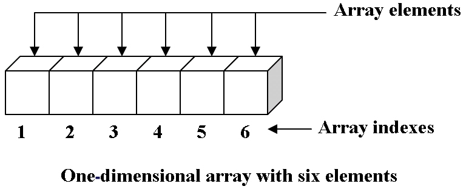

# CODEOLIO: Intro to Data Structures

## Overview

Welcome to CODEOLIO's Intro to Data Structures workshop. This workshop is meant to give you the fundamentals of some important data structures, such as arrays, stacks, queues, linked lists and binary search trees. 

More challenges and data structures will be added in the feature, so be sure to watch the repository for any updates.

Some of the descriptions below may be high-level, so if you need additional information to help you understand each data structure you can click on the links provided.

If you notice any errors, wish to make contributions or want to see something new/improved, please reach out! 

## Getting Started

Step 1: Fork this repository by clicking **fork**

Step 2: Clone this repository to your machine by clicking **Clone or Download** 
- If you do not have an IDE and Node installed on your machine, you can use https://gitpod.io. Follow the steps on gitpod to get setup
- If all dependencies are installed, open your terminal and run the command **git clone https://github.com/codeolio/workshop-data-structures.git**

Step 3: Install all dependencies in the package.json by running the command **npm install**

## Testing Your Code ##

Step 1: In your terminal run the command **npm test**

Step 2: On your first test, all unit tests should fail (You need to write some code!). Write some code that you think works. If you run it and see some green, you've passed!

### Dynamic Array

The array is a basic abstract data structure that holds an ordered collection of items accessible by an integer index. The items held can be anything from primitive data types such as integers to more complex types like objects (even other arrays!). 

A mentioned above, array elements are stored in a given index and can be retrieved at a later time by specifying the same index. The way these indices work is specific to the implementation and programming language, but don't worry too much about that. 

The main difference between a static array and a dynamic array is the ability to grow in size. In some programming languages (not in JavaScript) you need to specify exactly how much memory you want to store. This makes sure you can reserve enough adjacent places in memory to place each element for the given structure. If you never want this size to grow larger than what's initially declared, then you would say this array is static because it will never contain more than 10 elements. 

A structure is considered to be dynamic if it is not fixed in size. For example, if we have 10 elements and want to add another, go for it! 

Again, depending on how this structure is being implemented, there may be some performance implications to increasing the size of an array. JavaScript treats arrays a bit differently than a compiled languge like Java, but no need to think too much about that for now. 

There's no better way to learn about what the array is and does than to build one yourself! Your challenges are below: 

- [ ] Challenge 1: ```push``` method should add a single value to the end of the array, adjust length
- [ ] Challenge 1.5: (BONUS!) Refactor your ```push``` method so that it can add multiple values to the end of the array, adjust length
- [ ] Challenge 2: ```pop``` should return the last value pushed to the array, adjust length (don't go negative!)
- [ ] Challenge 3: ```shift``` method should add one value to the beginning of the array, adjust length
- [ ] Challenge 3.5: (BONUS!) Refactor shift method so that it adds multiple values to the beginning of the array
- [ ] Challenge 4: ```unshift``` should remove and return the first element at the beginning of the array
- [ ] Challenge 5: ```indexOf``` should return the position (index) of the first element in the Erray that matches the input value
- [ ] Challenge 6: ```lastIndexOf``` should return the position (index) of the last item in the Erray that matches the input value

If you're not familiar with some of these methods, please refer to [MDN for more details](https://developer.mozilla.org/en-US/docs/Web/JavaScript/Reference/Global_Objects/Array#)

- [Wikipedia: Array Data Structure](https://en.wikipedia.org/wiki/Array_data_structure)
- [Tutorials Point: Arrays](https://www.tutorialspoint.com/data_structures_algorithms/array_data_structure.htm)

### Stack


The stack is an abstract data type with a predefined capacity (stack overflow!). It's a pretty simple data structure because it allows the adding and removing of items/elements from just one end of the stack, typically called the 'top' of the stack. 

When we add a new element, it goes on the top of the stack. This is called pushing to the stack. When we want to remove something from the stack, we remove only the item that sits on the top of the stack, nothing below that item. The stack follows the principle of Last in First Out: The last item added to the stack will be the first item to leave the stack. 

You can conceptually think of a stack as being a stack of clean dinner plates. When we finish drying off a plate, we stick that plate on an existing pile of plates. If we want to remove a plate for use, we'll take from the top of the pile. Eventually, when we pile on too many plates, the stack of plates will fall. You can think of this as being a stack overflow - we hit the max number of plates the stack can support. 

There's no better way to learn about what the queue is and does than to build one yourself! Your challenges are below. For this exercise, you will not have to set a cap on your stack.

- [ ] Challenge 1: ```push``` method should add a single value to the top of the stack, adjust length
- [ ] Challenge 1.5: (BONUS!) Refactor your ```push``` method so that it can add multiple values to the top of the stack, adjust length
- [ ] Challenge 2: ```pop``` should return the last value pushed to the stack, adjust length (don't go negative!)
- [ ] Challenge 3: ```count``` method should return the total number of values/items in the stack
- [ ] Challenge 4: ```clear``` should remove all elements from the stack and adjust length, but should not delete the stack itself
- [ ] Challenge 5: ```isEmpty``` should return true if no items are in the stack, and false if it contains items
- [ ] Challenge 6: ```peek``` should return the value at the top of the stack without removing it
- [ ] Challenge 7: ```toString``` shuold return string representation of the stack, from top to bottom
- [ ] Challenge 8: ```toArray``` should return an array representation of the stack, from top to bottom
- [ ] Challenge 9: ```contains``` should return true of the item is in the stack, false if not

- [Wikipedia: Stack Data Structure](https://en.wikipedia.org/wiki/Stack_(abstract_data_type))
- [Tutorials Point: Stack](https://www.tutorialspoint.com/data_structures_algorithms/stack_algorithm.htm)
- [Geeks for Geeks: Stack](https://www.geeksforgeeks.org/stack-data-structure/)

### Queue

A queue is very similar to the stack, except rather than following the principle of LIFO (last in first out) they instead follow the principle of FIFO (first in first out). The first item added to the equeue is the first item that leaves the queue. 

Think of a queue as being similar to a line to a soda machine. The first person in line will be the first person to receive a soda, the second person in line will be the second one to get a sode, and so on. Another real-world example is a water slide. You enter the water slide from the top/beginning, and leave it from the end. If you're first to go down the slide, you're first to leave the slide. 

Some quick terminology, when we add something to a queue, we enqueue it. When we remove something from the queue, we dequeue it.

There's no better way to learn about what the queue is and does than to build one yourself! Your challenges are below.

- [ ] Challenge 1: ```enqueue``` should add single item to the end of the queue
- [ ] Challenge 1.5: (BONUS!) Refactor your ```enqueue``` method so that it can add multiple items to the end of the queue
- [ ] Challenge 2: ```dequeue``` should return the item at the beginning of the queue WITHOUT going negative
- [ ] Challenge 3: ```count``` should return the total number of items in the queue
- [ ] Challenge 4: ```clear``` should remove all items from the queue, but not delete the queue entirely
- [ ] Challenge 5: ```isEmpty``` should return true if no items are in the queue, false if items do exist in queue
- [ ] Challenge 6: ```peek``` should return the element at the front of the queue
- [ ] Challenge 7: ```toString``` should return all items in the queue from end to beginning
- [ ] Challenge 8: ```toArray``` should return all items in the queue as an array
- [ ] Challenge 9: ```contains``` should return true if a specific value is in queue, false if not

- [Wikipedia: Queue Data Structure](https://en.wikipedia.org/wiki/Queue_(abstract_data_type))
- [Tutorials Point: Queue](https://www.tutorialspoint.com/data_structures_algorithms/dsa_queue.htm)
- [Geeks for Geeks: Queue](https://www.geeksforgeeks.org/queue-data-structure/)

### Singly Linked List

The linked list is a special list abstract data type. In a linked list, we only have at maximum two points of entery: a head and tail pointer. The head pointer points at the first node in the linked list, and the tail pointer points at the last node of the linked list. 

What is a node? A node bundles two things: information (data) and a reference pointer to a neighboring (the next) node in the linked list. Unlike arrays where we can access information randomly based on some given index that maps to a value, the only way to access a nodes value is to traverse through the linked list, started at the head and working your way to the tail. 

Linked Lists are incredibly efficient (much more efficient than arrays) when it comes to adding, removing and inserting new values. For example, to append a new node, we simply adjust the current tail nodes next pointer and reassign tail to the new node. 

A real world example of a linked list would be a train. We have a head train (where the conductor is) and the tail train (the last cart). If we want to append a new cart, we can simply add a new cart to the end. 

- [ ] Challenge 1: ```push``` shoud add a new node to the end of the linked list, adjusts tail pointer
- [ ] Challenge 1.5: (BONUS!) Refactor your ```push``` method to add multiple nodes to end of linked list
- [ ] Challenge 2: ```addToHead``` adds a new node to the head of the linked list, adjusts head pointer
- [ ] Challenge 3: ```indexOf``` method should return the index of a specified value in the linked list. If the value does not exist, return -1
- [ ] Challenge 4: ```remove``` should remove the specified node from the linked list
- [ ] Challenge 5: ```removeHead``` method should remove the head node and adjust head pointer to point at subsequent node (if one exists)
- [ ] Challenge 6: ```removeTail``` method should remove the tail node and adjust tail pointer to point at the preceding node (if one exists)
- [ ] Challenge 7: ```getByIndex``` method should return the value of a node based on a specified index
- [ ] Challenge 8: ```removeByIndex``` method should remove a node based on given index 
- [ ] Challenge 9: ```isEmpty``` method should return true of no nodes are in linked list, false if nodes exist
- [ ] Challenge 10: ```toString``` method should return a string representation of the linked list
- [ ] Challenge 11: ```toArray``` method should return an array representation of the linked list
- [ ] Challenge 12: ```getHead``` method shoud return the head node value of the linked list
- [ ] Challenge 14: ```totalNodes``` method should return the total number of nodes in the linked list

- [Wikipedia: Linked List Data Structure](https://en.wikipedia.org/wiki/Linked_list)
- [Tutorials Point: Linked List](https://www.tutorialspoint.com/data_structures_algorithms/linked_list_algorithms.htm)
- [Geeks for Geeks: Linked List](https://www.geeksforgeeks.org/data-structures/linked-list/)

### Binary (Search) Tree


The binary tree is a tree with at most two children, A binary tree is made up of nodes, and each node has three properties: a value, a left child pointer and a right child pointer.

A binary search tree is an ordered tree that gives us the ability to perform quick lookup opertations (binary search!). For each node, all elements in its left subtree are less-or-equal to the node value the parent; and all elements in its right subtree are greater than the node.

- [ ] Challenge 1: ```insert``` method should add a new value to the tree
- [ ] Challenge 2: ```contains``` takes a value and searches the tree for it. return true if the value is in the tree, false if not
- [ ] Challenge 3: ```inOrderTraverse``` method visit all nodes of the tree in order (least to greatest), executing a given callback on each node value
- [ ] Challenge 4: ```preOrderTraverse``` method visit all nodes of the tree in order from left to right visiting parent nodes first then children nodes (google more on pre-order traversal if you need more details)
- [ ] Challenge 5: ```postOrderTraverse``` method visit all nodes of the tree in order from left to right visiting child nodes first then parent nodes (google more on pre-order traversal if you need more details), working its way up to the root (last node visited)
- [ ] Challenge 6: ```breadthTraversal``` method should visit all nodes of binary search tree by level, starting at the 0th level (root node), and working its way down to the last level (deepest leaf),  executing a callback on each value
- [ ] Challenge 7: ```min``` method should return the smallest value in the binary search tree
- [ ] Challenge 8: ```max``` method should return the largest value in the binary search tree
- [ ] Challenge 9: ```remove``` method should remove a node from the BST without effecting any children nodes

### Tree Traversal and Descriptions
- [Wikipedia: Binary Tree](https://en.wikipedia.org/wiki/Binary_tree)
- [Tutorials Point: Trees - Binary](https://www.tutorialspoint.com/data_structures_algorithms/tree_data_structure.htm)
- [Geeks for Geeks: Binary](https://www.geeksforgeeks.org/binary-tree-data-structure/)
